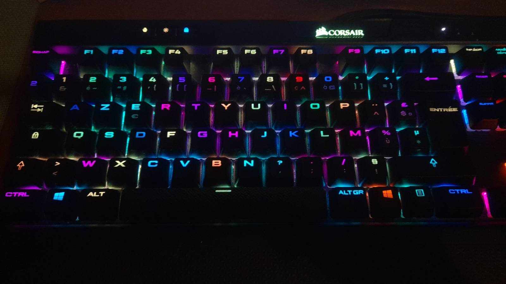
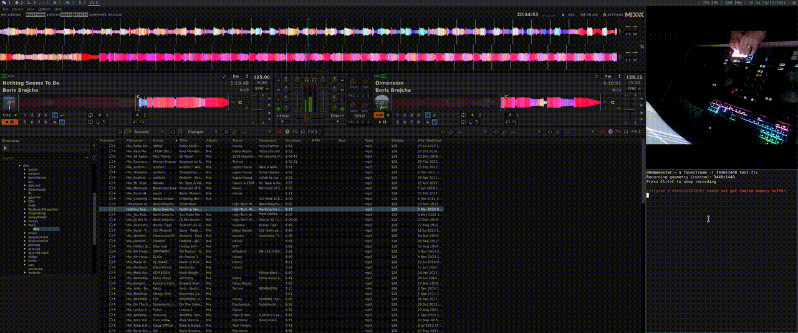

# OpenBSD HID

## Description

Work in progress project to improve the uhid "situation" on OpenBSD.
It contains kernel patches and a new OpenBSD backend for libhidapi.

Ported and tested softwares:
- **OpenRGB**: Tested with multiple Corsair keyboards.
- **Mixxx**: Tested with the Native Instruments Traktor Kontrol S2 MK3.

Below are some images illustrating the setup and software in action:

    
    
<i>OpenRGB controlling a Corsair CORSAIR K70 RGB MK.2 </i>

    
    
<i>Mixxx controlled by a Native Instruments Traktor Kontrol S2 MK3 and OpenRGB
controlling a Corsair Gaming K70 RGB RAPIDFIRE</i>

## Patches

The following kernel patches are in `patches/` folder:

* `add-ioctl-get-interface.diff` : Add new ioctl to retrieve the USB interface of a uhid device.
* `fix-input-feature-report.diff` : Fix uhidev_set_report handling for input and feature reports.
* `rewrite-report-ring.diff` : Add and use a ring buffer for input reports.

## Ports

The following ports are in `ports/` folder:

* `audio/mixxx` and its dependencies
* `comms/libhidapi` with a the new backend
* `sysutils/openrgb`
